[toc]


# **Astra**

> - **来源/灵感：** 拉丁语"星星"，也有"导航"的隐喻。
> - **寓意：**在浩瀚如星空般的互联网信息海洋中，Astra就像是一颗**导航星**，帮助用户在碎片化的知识中找到方向，不再迷失

## 功能设计

* 知识库 

  * 创建知识库

    * 

  * 知识入库

    * 文件上传知识库，文件预览
      * PDF 文档解析与向量化存储(=> 全类型文件解析与向量化存储)，支持文档内容检索问答
      * 安全校验机制，通过MIME类型验证和SHA256文件完整性校验

    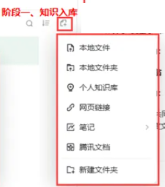

    > #### 支持格式
    >
    > * 支持
    >   * 本地文件：PDF / Word / 音频 / 图片 / XMind
    > * 暂时未支持
    >   * 网页链接
    >   * astra原生内容
    >     astra 问答记录……
    >
    > 

  * 知识管理

    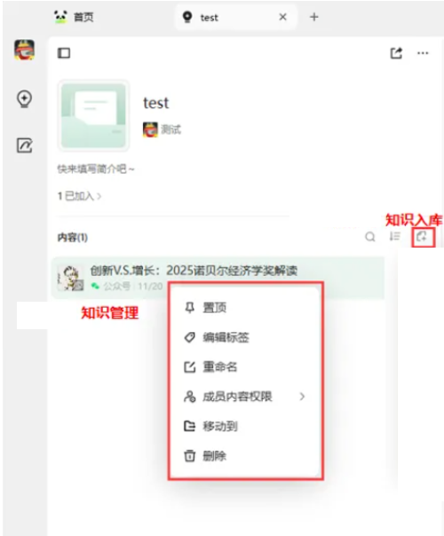

  * 查看个人知识库

  * 知识应用

    **基于知识库进行问答**

    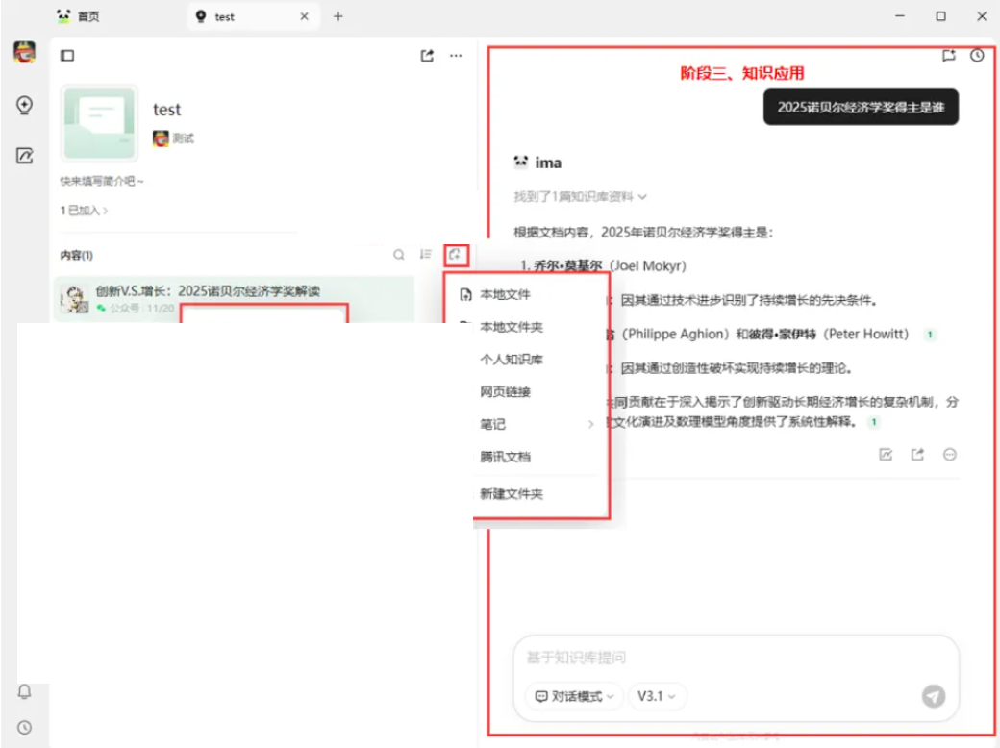

  

  * 删除知识库

    （需要一并清理知识列表、Media、分片、和cos文件）

    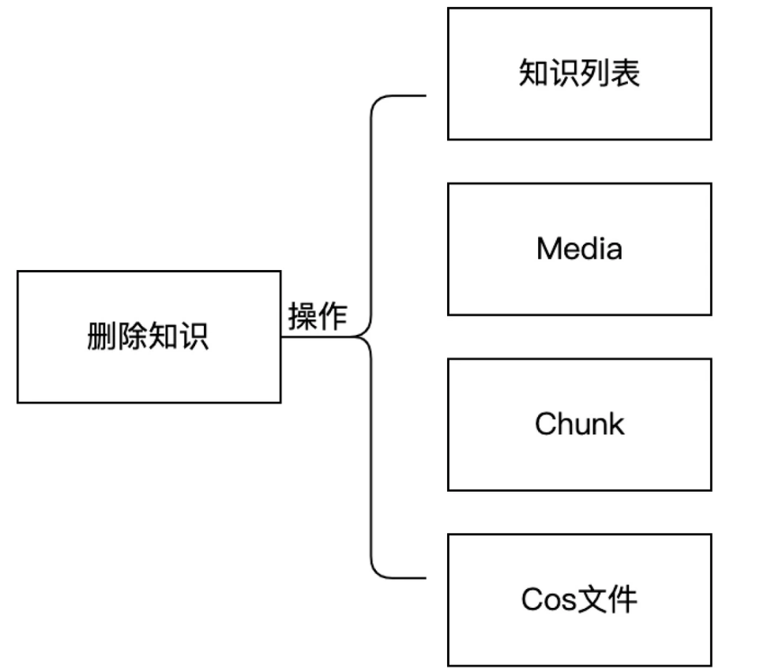

  * 

* 会话管理，自动创建和维护用户对话历史

* 暂时不支持（too busy😭）

  * 文件夹功能(一个知识库下有多个文件夹，文件可以直接上传之后库或者上传到知识库的文件夹)
  * 团队知识库 / 共享知识库
  * (知识库合并)
  * (加入他人知识库)
  * 搜索


## 参考原型图

> 参考ima ⬇️

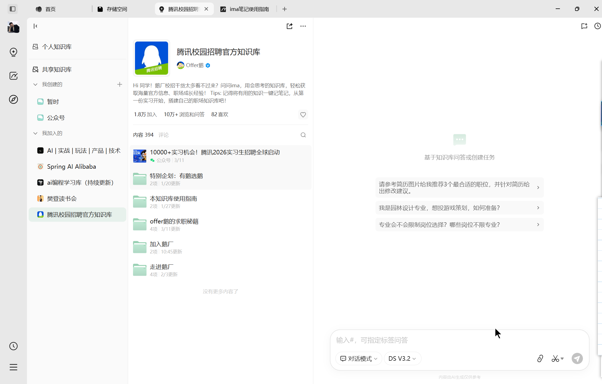

创建知识库：

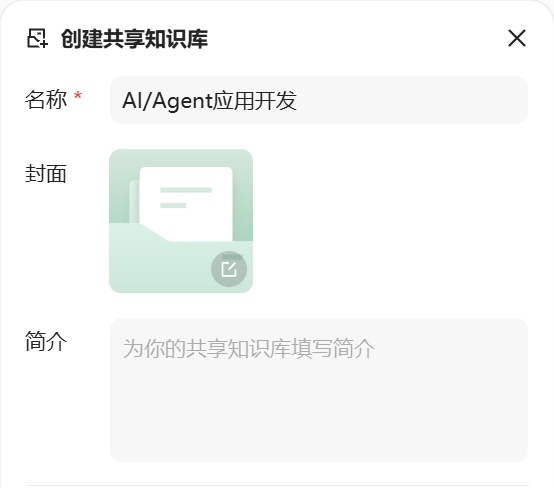

上传文档：

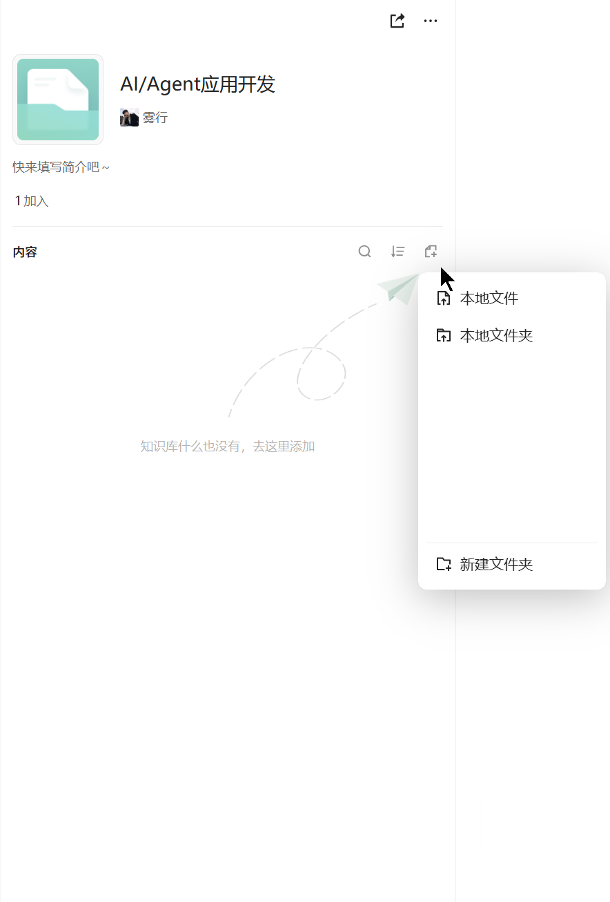

支持排序：

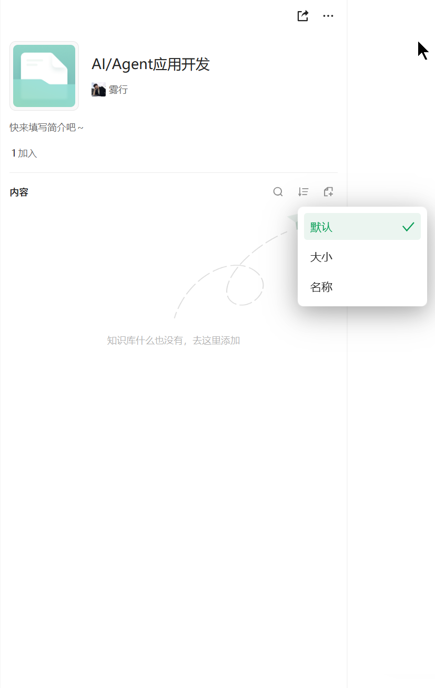

支持创建文件夹

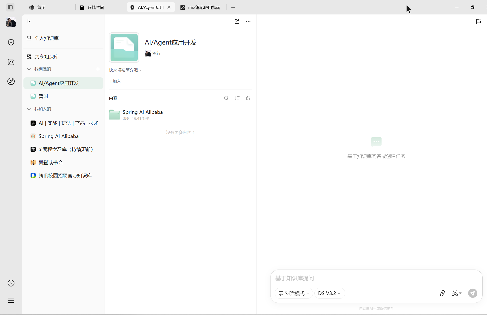

支持文件直接上传到 知识库/知识库内的文件夹（并显示该文档的解析进度）


支持基于知识库的问答

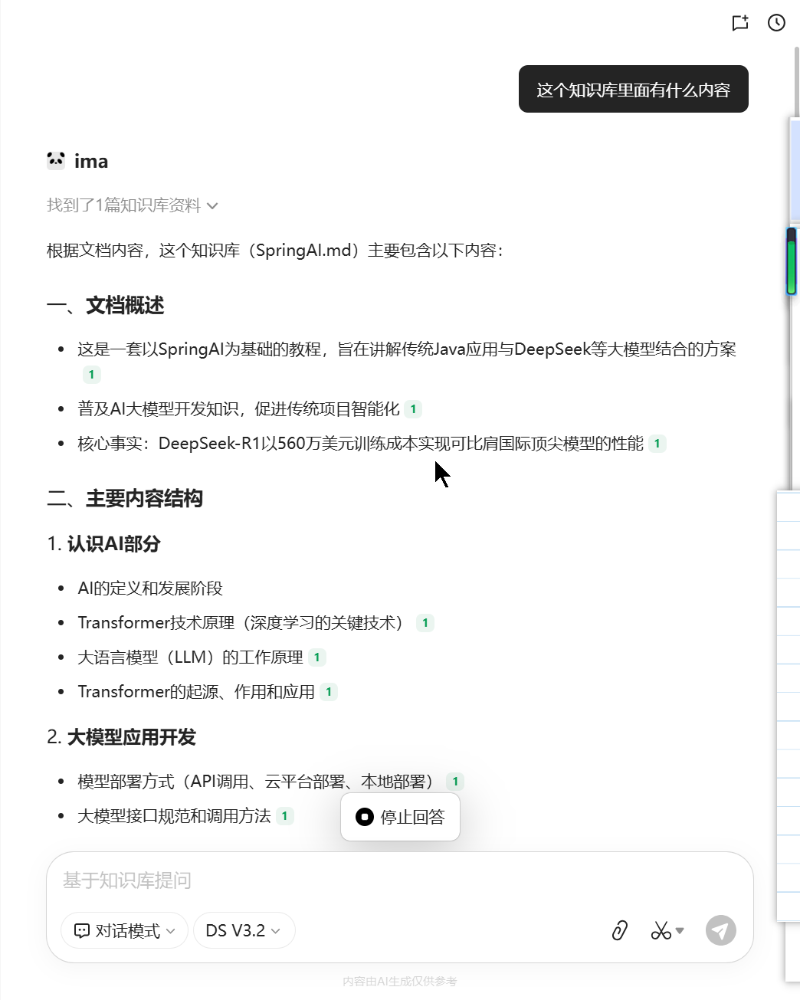

支持新建会话/查看回话历史

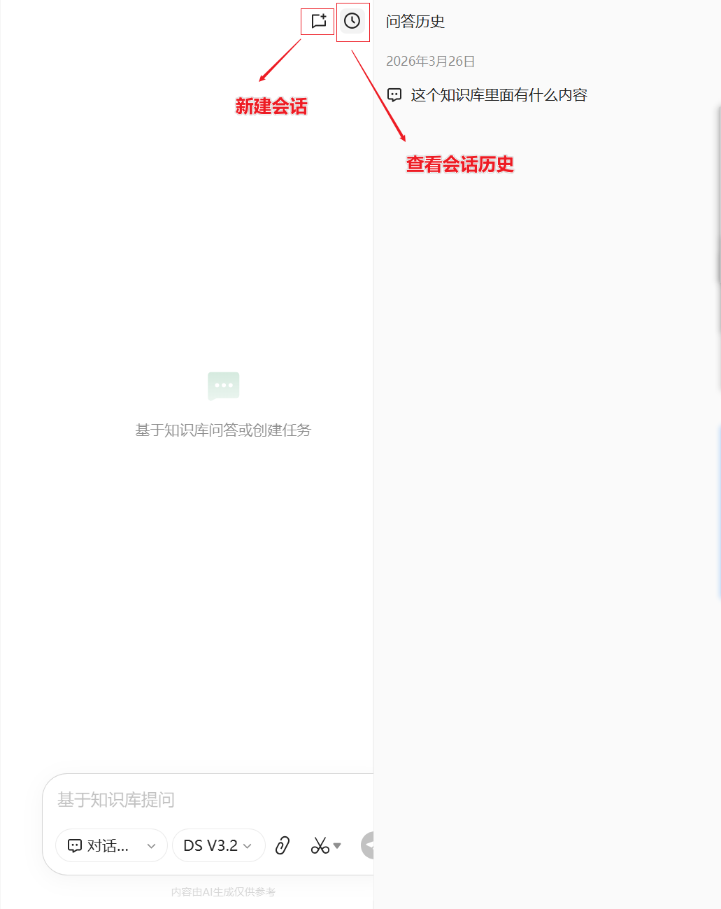


# 向量数据库选型

> **结论：选用 pgvector（PostgreSQL 扩展）**
>
> 理由：零额外成本、零运维复杂度、与现有 PostgreSQL 共用基础设施，适合本项目初期中小规模知识库场景。


## 一、选型背景

Astra 知识库需要存储和检索文档的向量嵌入（Embedding），用于 RAG（检索增强生成）场景。向量数据库是 RAG 系统的基础组件，负责：

1. **存储**文档切分后的 Chunk 向量
2. **索引**向量，支持高效相似度搜索
3. **召回**与用户问题最相关的 Top-K Chunk，交给 LLM 生成答案


## 二、候选方案对比

### 2.1 候选列表

| 向量数据库   | 类型            | 部署方式              | Spring AI 集成              |
| ------------ | --------------- | --------------------- | --------------------------- |
| **pgvector** | PostgreSQL 扩展 | 复用现有 PostgreSQL   | `spring-ai-jdbc` / 原生 SQL |
| **Milvus**   | 专用向量数据库  | Docker / K8s 独立部署 | REST API / gRPC             |
| **Qdrant**   | 专用向量数据库  | Docker 独立部署       | REST API                    |
| **Chroma**   | 专用向量数据库  | Python embed-only     | REST API                    |
| **Weaviate** | 专用向量数据库  | Docker 独立部署       | REST API / GraphQL          |

### 2.2 详细对比

| 维度                 | pgvector                       | Milvus                     | Qdrant                |
| -------------------- | ------------------------------ | -------------------------- | --------------------- |
| **额外成本**         | **0**（复用 PostgreSQL）       | 需要独立服务器             | 需要独立服务器        |
| **部署难度**         | **极简**（`CREATE EXTENSION`） | 中等（Docker/K8s）         | 简单（Docker 单节点） |
| **运维复杂度**       | **极低**（与 PostgreSQL 共管） | 高（独立服务、监控、备份） | 中（独立服务）        |
| **数据规模**         | 百万级                         | 亿级+                      | 千万级                |
| **查询性能**         | 中等（< 100 万向量无压力）     | 优秀                       | 优秀                  |
| **事务支持**         | **完整 ACID**                  | 不支持                     | 不支持                |
| **备份方式**         | PostgreSQL 统一备份            | 独立备份                   | 独立备份              |
| **Spring AI 集成**   | `spring-ai-jdbc` 直连          | REST API                   | REST API              |
| **与现有系统契合度** | **最高**（共用数据库）         | 需引入新服务               | 需引入新服务          |

### 2.3 成本估算

| 方案             | 额外服务器 | 月均成本（估算） |
| ---------------- | ---------- | ---------------- |
| **pgvector**     | **0**      | 0 元             |
| Milvus（单节点） | 1 台 2C4G  | ≈200 元/月       |
| Qdrant（单节点） | 1 台 2C4G  | ≈200 元/月       |


## 三、pgvector 核心说明

### 3.1 什么是 pgvector

pgvector 是 PostgreSQL 的扩展，专门用于存储和检索向量嵌入。支持：

- **向量类型**：`vector(dim)`，如 `vector(1536)` 存储 1536 维 Embedding
- **距离计算**：欧氏距离（`l2`）、负内积（`ip`）、余弦距离（`cosine`）
- **索引算法**：`ivfflat`、`hnsw`（类似 Facebook FAISS 的 HNSW 算法）


### 3.2 示例表结构

```sql
-- 启用扩展
CREATE EXTENSION IF NOT EXISTS vector;

-- Chunk 向量表
CREATE TABLE kb_chunk (
    id          BIGSERIAL PRIMARY KEY,
    library_id  BIGINT NOT NULL,                    -- 所属知识库
    media_id    BIGINT NOT NULL,                    -- 关联的 Media
    content     TEXT,                               -- 原始文本
    embedding   vector(1536),                       -- 向量嵌入（以 1536 维为例）
    metadata    JSONB,                               -- 扩展元信息
    created_at  TIMESTAMP DEFAULT NOW()
);

-- 创建 HNSW 索引（召回率高，查询快）
CREATE INDEX ON kb_chunk USING hnsw (embedding vector_cosine_ops);

-- 相似度查询示例
SELECT id, content, 1 - (embedding <=> $query_embedding) AS similarity
FROM kb_chunk
WHERE library_id = $library_id
ORDER BY embedding <=> $query_embedding
LIMIT 10;
```

### 3.3 Spring AI 集成

#### 安装

[AI开发技术学习之一：向量数据库 pgvector编译与安装 - 知乎](https://zhuanlan.zhihu.com/p/1980578000966793197)


#### 集成

`spring-ai-alibaba` 通过 JDBC 连接 PostgreSQL，配合 `VectorStore` 接口即可：

```java
@Configuration
public class VectorStoreConfig {

    @Bean
    public JdbcVectorStore vectorStore(JdbcTemplate jdbcTemplate,
                                        EmbeddingModel embeddingModel) {
        return new JdbcVectorStore(jdbcTemplate, embeddingModel,
            new JdbcVectorStoreOptions("kb_chunk", 1536));
    }
}
```


---

## 四、适用规模与扩展路线

### 4.1 pgvector 性能天花板

| 数据规模        | 性能表现      | 建议                     |
| --------------- | ------------- | ------------------------ |
| < 10 万向量     | 极快，毫秒级  | 直接使用 pgvector        |
| 10 万 ~ 100 万  | 良好，10~50ms | pgvector + HNSW 索引     |
| 100 万 ~ 500 万 | 开始吃力      | 可继续观察，优化参数     |
| > 500 万        | 性能明显下降  | 考虑迁移至 Milvus/Qdrant |

### 4.2 扩展路线

```
第一阶段（当前）
└── pgvector + PostgreSQL 共用
    └── 适合 < 100 万向量的中小规模知识库

第二阶段（如需）
└── 引入 Milvus 作为专用向量库
    └── PostgreSQL 保留业务数据
    └── Milvus 处理向量检索
    └── 数据同步方案：定时导出 Chunk 到 Milvus
```

---

## 五、最终结论

**选定 pgvector**，理由总结：

1. **零成本**：复用现有 PostgreSQL，无需额外服务
2. **零运维**：不需要单独部署、监控、备份向量数据库
3. **低迁移风险**：所有数据在 PostgreSQL，出了问题容易排查
4. **够用就好**：个人/小团队知识库 < 100 万向量，pgvector 性能完全满足
5. **与现有架构契合**：Spring Boot + PostgreSQL 是本项目核心技术栈，天然集成

> **后续如果 Astra 知识库规模超过 500 万向量，再评估引入 Milvus 等专用向量数据库，在此之前不做过度设计。**

---

## 六、参考资料

- [pgvector 官方文档](https://github.com/pgvector/pgvector)
- [Spring AI VectorStore 文档](https://docs.spring.io/spring-ai/reference/api/vectorstore.html)
- [Milvus vs pgvector 对比](https://medium.com/@tokeninsight/pgvector-vs-milvus-which-one-should-you-choose)


# Embedding 模型选择


* 模型：text-embedding-v3
* 维度：1024


# 解决方案


## 会话管理

复用当前多模态对话系统的会话管理功能，其中 `type` 字段设为`astra`


## 多轮过滤


### 一、预过滤（Pre-Filtering）

> 使用硬规则过滤

* **动作**：根据用户身份、时间范围、文档类型进行 SQL/NoSQL 级别的过滤。
* **例子**：`WHERE department = 'HR' AND status = 'published' AND date > '2023-01-01'`。
* **目的**：确保绝对的安全性和时效性。这一步做完，候选集可能从 100 万篇变成了 5000 篇。


### 二、检索策略-混合检索


**混合检索 (Hybrid Retrieval) —— 宽泛召回**

- 动作：同时使用 **关键词检索 (BM25) 和 向量检索 (Dense Vector)**
  - BM25 擅长匹配专有名词、精确术语。
  - Vector 擅长匹配语义、同义词。
- **取数**：分别从两个渠道各取前 50 名，合并去重，得到约 80-100 个候选片段。
- **目的**：防止向量检索漏掉关键术语

> **纯向量检索 (Pure Vector Search)**
>
> * 动作：仅使用 **向量检索 (Dense Vector)**


> #### 混合检索的其他方案
>
> ```
> 用户问题
>     ├── 关键词检索（BM25 / TF-IDF）→ 候选集 A
>     └── 向量检索（Embedding）→ 候选集 B
>               ↓
>          合并 + 重排序（RRF / 加权）
>               ↓
>            Top-K 结果
> ```
>
> **原理**：同时执行传统关键词检索和向量检索，然后用 **RRF（Reciprocal Rank Fusion）** 或**加权分数**合并结果。
>
> **RRF 公式**：
>
> ```
> score(chunk) = Σ 1 / (rank_i + k)
> ```
>
> 其中 `rank_i` 是该 chunk 在第 i 种检索方式中的排名，`k` 是平滑因子（通常取 60）。
>
> 
>
> **优点**：
>
> - 兼顾语义相似性和关键词精确匹配
> - 鲁棒性强，不同类型 query 都能有保障
>
> **缺点**：
>
> - 需要维护两套索引（倒排索引 + 向量索引）
> - 延迟更高，复杂度翻倍
> - 权重/融合策略需要调优


### 三、后过滤（Post-Filtering）

> 软规则过滤


- 动作：
  - **去重**：移除内容高度重复的片段。
  - **长度过滤**：剔除太短（无信息量）或太长（超出窗口）的片段。
  - **轻量打分**：用一个轻量模型（如 Cross-Encoder 的简化版）快速过一遍，分数低于 0.3 的直接丢弃。
- **结果**：候选集从 100 个缩减到 20-30 个高质量片段。


### 四、ReRank 重排序

* **动作**：使用高精度的 ReRank 模型（如 `bge-reranker-v2-m3` 或 `Cohere Rerank`）对这 20-30 个片段进行深度语义打分。
  * 重排序模型（Cross-Encoder / Colbert / BGE-Reranker）
  
    > 为降低运维成本，采用 DashScope API，不采用本地部署
* **常见的重排序方案**：
  - **Cross-Encoder**：两两过模型，精度最高但最慢
  - **BGE-Reranker**：阿里开源，效果好，速度较快
  - **Colbert**：向量化的 token 级别匹配，兼顾速度和精度
* **作用**：
  * 向量检索**快但粗糙**，适合大海捞针
  * 重排序**慢但精准**，适合精筛
* **结果**：重新排序，<u>取 **Top 10** 或 **Top 5**</u>


## Prompt模版

```markdown
# 知识库问答 Prompt 模板

## 系统 Prompt
你是一个文档问答助手。请根据以下参考内容回答用户问题。
如果参考内容中没有相关信息，请如实告知，不要编造。

## 用户问题
{user_question}

## 参考内容
{context_chunks}


## 回答要求
1. 引用时标注来源
2. 不知道的内容明确说明
3. 回答简洁有据

```

> 参考内容的格式：每个 Chunk 前标注来源：[文件A-第3页]
>


## 解决-知识入库(多格式数据入库)

> 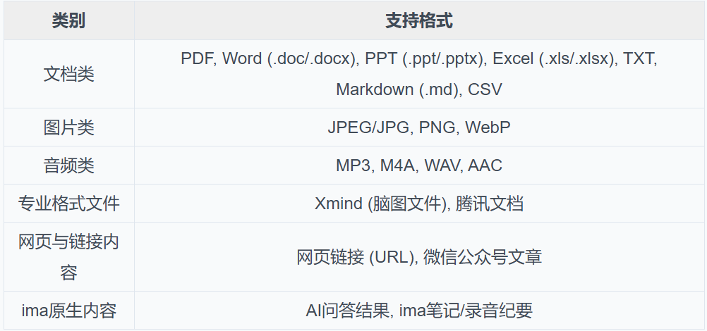
>
> 如果每接入一种新格式，就需要对现有的数据进行翻天覆地的改变，那带来的开发成本无疑是巨大的，系统也将变得高度耦合且极其脆弱

* **建立统一的内部数据格式，解耦外部源与内部系统**

  定义一套 Astra 专属的、标准化的内部数据格式。将外部数据源的格式统一转换成内部的统一结构。这个策略通过两个层面的格式定义来实现，分别服务于用户侧展示/管理和底层 RAG 系统，从而将外部数据源的复杂性与内部的业务逻辑彻底解耦。

  > **借鉴自ima**


#### 基础概念 

1.面向用户侧的统一结构：Media

Media是为用户进行展示和管理而设计的统一数据结构。它代表了用户添加到 ima 的任何一份知识资产，是用户在界面上交互的直接对象。

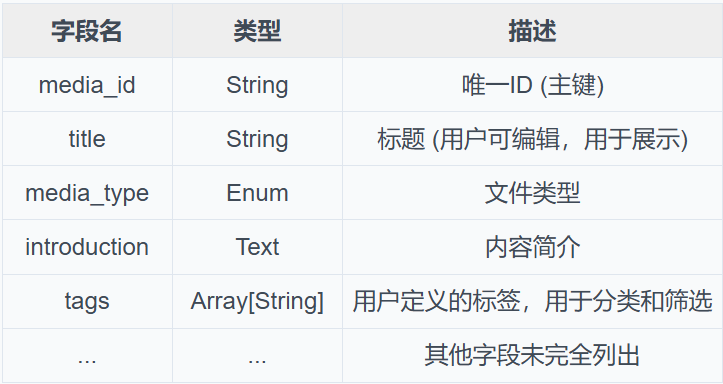

> 本项目中的 Media 原生文件存在OSS


2.面向 RAG 系统的统一结构：Chunk

Chunk 是为底层进行解析、索引和 RAG 检索而设计的标准数据单元(**面向 RAG 检索系统的统一数据结构**)。它是知识在 RAG 系统内部流通和处理的最小载体，确保了RAG系统可以一视同仁地处理所有来源的知识


#### 架构

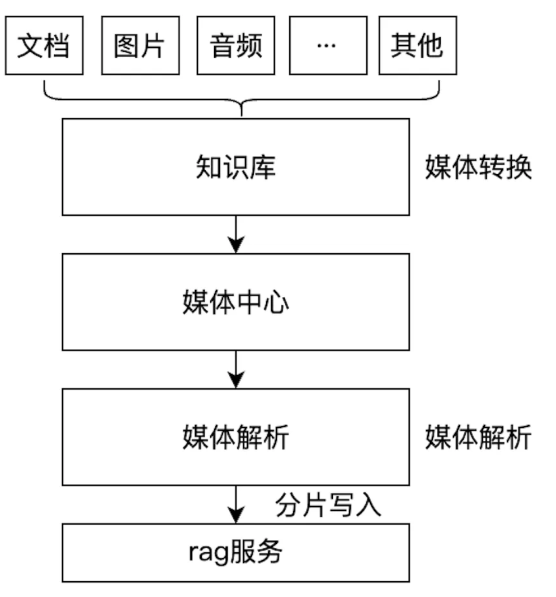

* 阶段一：媒体转换

  知识库服务 作为统一入口，负责接收用户输入的各类数据。它并不直接处理文件内容，而是立即**将其元信息（如文件名、类型）创建并持久化为统一的 Media 结构**，<u>存入媒体中心</u>

* 阶段二：媒体解析

  有了前置创建的Media ，**媒体解析服务会根据 Media 的类型，将原始文件解析并切分成一系列标准化的 Chunk 结构**

* 阶段三：分片写入

  最后，这一批结构完全一致的 Chunk 被**写入底层 RAG 服务**，用于后续的索引、检索以及最终的 AI 应用。


这个原型虽然解决了数据结构的统一问题，但它掩盖了一个更深的复杂性：生成这些结构的过程本身是高度非标准化的。这正是我们面临的第二个挑战。


#### 多格式数据 处理流程的标准化与统一

不同数据源的获取方式和处理逻辑都存在巨大差异，如果为每一种组合都编写一套独立的流程，系统将迅速变得混乱不堪。这些差异主要体现在以下几个方面

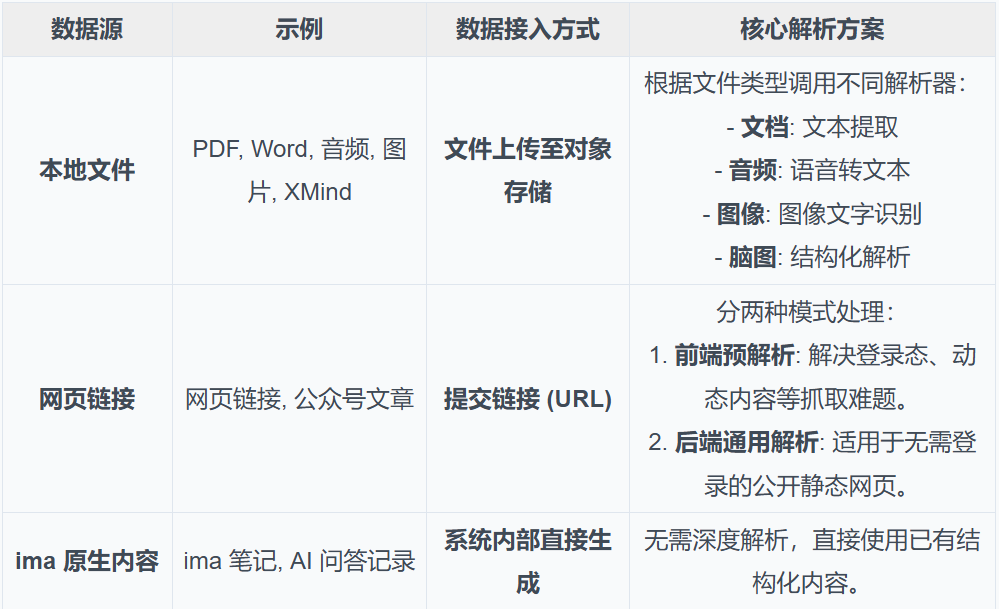

解法：隔离变化，构建解耦的知识入库流程

我们的核心解法，源于软件架构的一条黄金法则：识别并隔离变化。我们将知识库入库流程拆分为两个关注点完全不同的层级——稳定的“统一接入层”和灵活的“独立解析层”，从而构建了一个既稳固又极具生命力的系统架构。

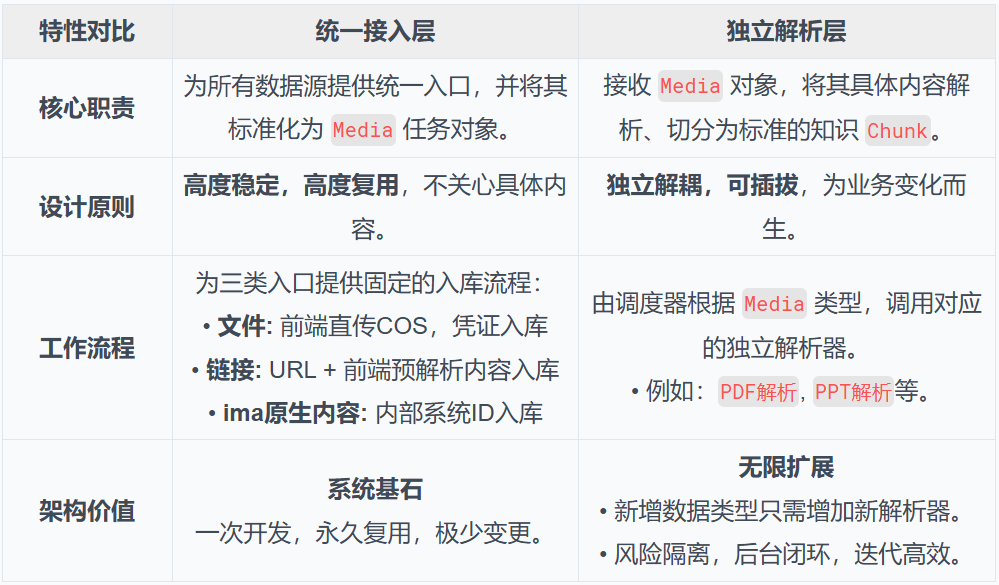

由此我们的架构又引入多个新模块，以确保整个入库流程的稳定性与可拓展性：


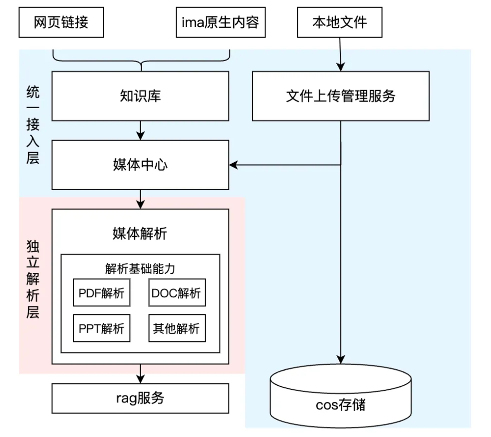

##### ==文件解析器 技术选型==

流程：

```
文件上传
   │
   ▼
┌─────────────────────────────┐
│     格式检测（Tika 自动）      │
└─────────────────────────────┘
   │
   ├───── PDF ──────► PDFBox 文本提取
   │                  │
   │                  ├─ 图片页 ──► 阿里 OCR
   │                  └─ 文本页 ──► 直接提取
   │
   ├───── Word ─────► Apache POI / Tika
   │
   ├───── 图片 ─────► 阿里 OCR
   │
   ├───── 音频 ─────► DashScope ASR
   │
   └───── XMind ────► ZIP解压 + JSON解析
                        │
                        ▼
                 ┌─────────────────┐
                 │  内容清洗 + 标准化 │
                 └─────────────────┘
                        │
                        ▼
                 ┌─────────────────┐
                 │  智能分块（递归+结构)│
                 └─────────────────┘
                        │
                        ▼
                 ┌─────────────────┐
                 │  Embedding 向量化 │
                 │  (DashScope text- │
                 │   embedding v2)   │
                 └─────────────────┘
                        │
                        ▼
                 ┌─────────────────┐
                 │   存入向量数据库  │
                 └─────────────────┘

```


| 模块         | 推荐选型         | 理由                  |
| ------------ | ---------------- | --------------------- |
| PDF 文本提取 | PDFBox + Tika    | 纯 Java、生态成熟     |
| 扫描件 OCR   | 阿里 OCR API     | 生态统一、精度高      |
| 音频转写     | DashScope ASR    | 现有 AI 生态、无新SDK |
| Word 解析    | Apache POI       | 纯 Java               |
| XMind 解析   | 自研（ZIP+JSON） | 格式简单、自研成本低  |

**1.技术选型-PDF解析**

**PDFBox + Tika**

| 库                  | 优势                      | 劣势              | 适用场景     |
| ------------------- | ------------------------- | ----------------- | ------------ |
| **PDFBox** (Apache) | 纯 Java、轻量、社区活跃   | 表格/图片提取弱   | 文本提取为主 |
| **iText**           | 表格重建能力强            | AGPL 商业版权问题 | 需要精确表格 |
| **Tika** (Apache)   | 支持 1000+ 格式、自动检测 | 定制化困难        | 格式自动识别 |

**对于当前的项目**：PDFBox 足以应付大多数场景，配合 Tika 做格式自动检测。


**2.技术选型-图片解析**

**扫描件 PDF/图片类**：必须走 OCR

OCR 方案：**推荐：Tesseract OCR（本地）或 百度/阿里 OCR API（云端）**

| 方案          | 优势                        | 劣势                     | 成本               |
| ------------- | --------------------------- | ------------------------ | ------------------ |
| **Tesseract** | 免费、本地部署、数据隐私    | 精度不如商业方案、需训练 | 零（GPU 机器成本） |
| **百度 OCR**  | 精度高、支持多语言          | 需申请 API、费用         | 按调用量计费       |
| **阿里 OCR**  | 与 DashScope 同家，生态整合 | 同上                     | 按调用量计费       |

**对于当前项目**：考虑到后端已经用 DashScope（阿里云），建议用**阿里 OCR**，统一账号体系，费用可控。


**3.技术选型-Word解析**

Apache POI


**4.技术选型-XMind解析(暂时不做，没时间)**

**推荐：XMind Zen AST 解析 + 手动映射**

XMind 文件本质是 **ZIP 压缩包**，解压后是 XML 结构：

```
example.xmind
├── content.json       # 主题结构（核心）
├── meta.xml           # 元数据
├── comments/          # 评论
└── styles.xml         # 样式
```

解析策略：

```java
// 伪代码思路
public class XMindParser {
    public String extractContent(File xmindFile) {
        // 1. 解压 ZIP
        // 2. 解析 content.json，提取所有主题的 text
        // 3. 按层级结构拼接为纯文本（或保留 Markdown 树结构）
        
        // 示例输出：
        // # 项目计划
        // ## 阶段一
        // - 任务 A
        // - 任务 B
        // ## 阶段二
    }
}
```

不需要完整解析所有样式字段，**只需提取主题文本 + 层级关系**即可。


**5.技术选型-音频转写(暂时不做，没时间)**

**推荐：Whisper（本地）或 DashScope ASR（云端）**

| 方案                 | 优势                         | 劣势              | 成本       |
| -------------------- | ---------------------------- | ----------------- | ---------- |
| **Whisper** (OpenAI) | 精度高、开源免费             | 本地 GPU 资源消耗 | 机器成本   |
| **DashScope ASR**    | 与现有 AI 生态整合、API 简单 | 费用              | 按分钟计费 |

**对于你的项目**：直接用 **DashScope ASR**（叫 `qwen-audio-turbo` 或类似模型），避免引入额外技术栈


## 解决-入库洪峰冲击与解析能力的瓶颈

知识入库流量并非平稳的线性增长，而是呈现出典型的脉冲式特征——例如，团队在项目结束后集中上传大量文档，或新用户在初期批量导入历史资料。这种短时间内集中爆发的请求，我们称之为“入库洪峰”

与之相对，系统的解析能力是一个相对恒定的物理上限。文件解析，尤其是针对大型文档和音视频的转译，是典型的 CPU 与内存密集型重任务，这构成了我们系统的“解析能力瓶颈”。

> 当不可预测的“入库洪峰”直接冲击在刚性的“解析能力瓶颈”上时，一个简单的同步处理架构会立刻暴露出其脆弱性，并引发下表所示的一系列连锁负面反应：
>
> 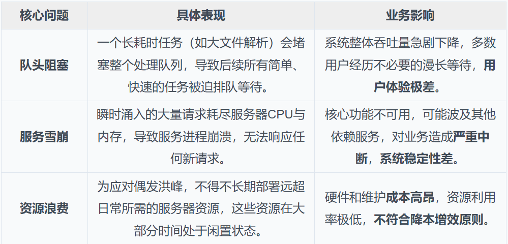==队头阻塞、服务雪崩、资源浪费==
>
> 


**解法：异步削峰与体验优化**

针对该挑战，我们采用了业界成熟的异步化架构，其核心是**利用消息队列对前端请求与后端处理进行解耦，实现流量的“削峰填谷”**。这确保了即使在“入库洪峰”期间，系统也能平稳接收请求，避免服务过载。

> “具体实现上，我们结合了ima的实际场景做了一些细节处理，策略的具体实现细节欢迎关注更多ima的文章。”

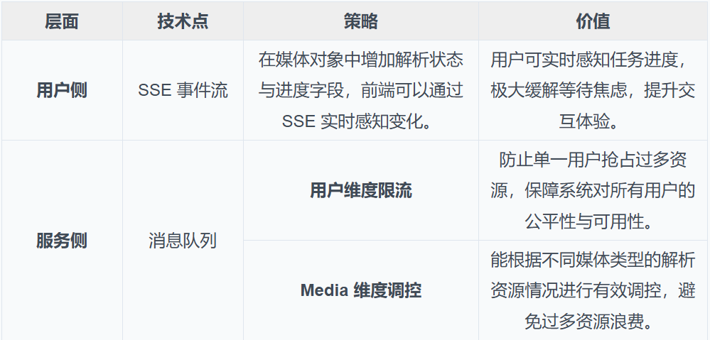


进一步的架构更新：

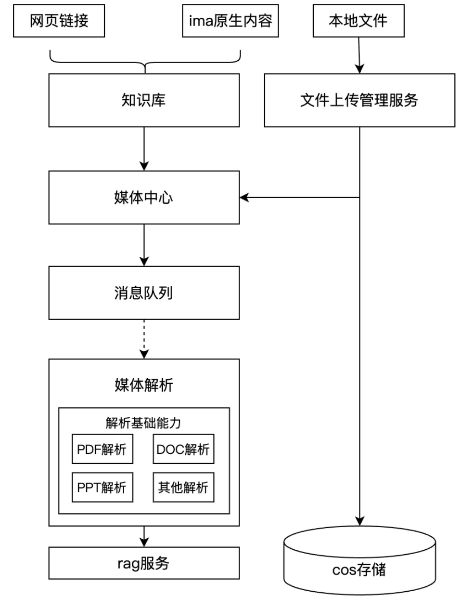


##### 解析进度通知机制

> - **方案A：SSE 推送**（推荐）——服务端主动推送，适合实时场景
> - **方案B：前端轮询**（简单）——每 2-3 秒轮询 `/media/{id}/status`
> - **方案C：WebSocket**（复杂）——适合需要双向通信的场景

使用 **SSE**，因为解析是长任务，流式推送体验更好

---

###### SSE 端点设计

**端点路径**：`GET /api/v1/astra/media/{mediaId}/stream`

**连接建立**：前端上传文件成功后，立即建立 SSE 连接，监听该文件的解析进度。

**SSE 事件格式**：

```
event: progress
data: {"mediaId": 123, "status": "PARSING", "totalChunks": 50, "parsedChunks": 12, "percent": 24}

event: complete
data: {"mediaId": 123, "status": "PARSED", "totalChunks": 50, "parsedChunks": 50}

event: error
data: {"mediaId": 123, "status": "FAILED", "error": "文件格式不支持或文件损坏"}
```

| 事件类型 | 触发时机 | 关键字段 |
|----------|----------|----------|
| `progress` | 消费者每解析完一个 Chunk 时推送 | `parsedChunks` / `totalChunks` / `percent` |
| `complete` | 解析全部完成时推送 | `status=PARSED` |
| `error` | 解析失败时推送 | `status=FAILED` + `error` 原因 |

---

###### 前端 SSE 连接生命周期

```javascript
// 1. 建立连接
const eventSource = new EventSource(`/api/v1/astra/media/${mediaId}/stream`);

// 2. 监听进度
eventSource.addEventListener('progress', (e) => {
  const data = JSON.parse(e.data);
  updateProgressBar(data.percent);
  updateStatus(data.status);
});

// 3. 监听完成
eventSource.addEventListener('complete', (e) => {
  showSuccess('解析完成');
  eventSource.close();
});

// 4. 监听错误
eventSource.addEventListener('error', (e) => {
  const data = JSON.parse(e.data);
  showError(data.error);
  eventSource.close();
});

// 5. 连接超时兜底
setTimeout(() => eventSource.close(), 5 * 60 * 1000);
```

**注意事项**：
- SSE 是**单工**通道，只支持服务端推送
- 浏览器对单域名 SSE 连接数有限制（6个），大量并发上传时控速
- 网络断开时浏览器不会自动重连，前端需自行实现重连逻辑


##### ==消息队列 技术选型==

**选择 Redisson RStream（基于 Redis Stream）**

* 主要优点
  * **API 封装完善**：消息发送、消费、ACK 均有一行代码的简洁接口
  * **延迟队列内置**：通过 `RDelayedQueue` 实现延迟重试，无需 Thread.sleep 阻塞
  * **支持重试机制**：可配置最大重试次数和延迟时间
  * **死信队列支持**：消息失败后可自动/手动移入 DLQ
  * **消费者组管理**：简化了 XREADGROUP 的复杂度
* 主要弊端
  * 需引入 Redisson 依赖（约 500KB）
  * 需要 Redis 5.0+（支持 Stream 数据结构）

> 原生 Redis Stream API 较为底层，需要手动处理消费组、阻塞读取、消息 ACK 等。Redisson 对其进行了优雅封装，显著提升开发效率和代码可维护性。


---

##### ==消息队列 消费者设计==

**一、队列命名**

```
astra:parse:queue        -- 主解析队列
astra:parse:dlq          -- 死信队列（处理失败后人工/定时处理）
astra-parse-group         -- 消费者组名
```

**二、消息结构**

| 字段 | 类型 | 说明 |
|------|------|------|
| `mediaId` | Long | 待解析的媒体文件 ID |
| `libraryId` | Long | 所属知识库 ID |
| `fileType` | String | 文件类型（PDF/WORD/IMAGE...） |
| `ossKey` | String | OSS 文件路径 |
| `retryCount` | Integer | 已重试次数，初始 0 |
| `createdAt` | Long | 入队时间戳（毫秒） |

**三、消费者组设计**

```
                          ┌─ Consumer-A ──→ 处理消息 ──→ ACK
                          │
astra:parse:queue ──┼─ Consumer-B ──→ 处理消息 ──→ ACK  （竞争模式，每条消息只被一个消费者处理）
                          │
                          └─ Consumer-C ──→ 处理消息 ──→ ACK

消费者数量可按需扩容（1-N），适合应对解析瓶颈
```

- **并行度**：消费者数量 = `min(文件并发数, CPU 核心数)`，建议 2-4 个
- **阻塞读取**：使用 Redisson `RStream.read()` API
  - 每次取 1 条，保证公平分发给多个消费者
  - 无消息时阻塞等待，避免空转 CPU

**四、处理流程**

```
┌─────────────────────────────────────────────────────────┐
│                  消费者主循环                            │
│                                                         │
│  stream.read(consumerGroup, consumerName, params)     │
│         │                                               │
│         ▼                                               │
│   ┌───────────┐                                         │
│   │ 有消息？   │──否── 继续阻塞等待新消息               │
│   └─────┬─────┘                                         │
│         │是                                             │
│         ▼                                               │
│   ┌───────────┐                                         │
│   │ 解析文件   │                                         │
│   │ 生成Chunk │                                         │
│   └─────┬─────┘                                         │
│         │                                               │
│         ├──成功───→ ACK ──→ 继续取下一条                │
│         │                                               │
│         └──失败                                         │
│                │                                         │
│                ▼                                         │
│         retryCount < 3？                                │
│            │                                            │
│       是──→ retryCount++                                │
│                │                                        │
│                └── RDelayedQueue.offerAsync()           │
│                    (延迟5秒后自动重新入队)                │
│                                                         │
│           否──→ 移入 DLQ ──→ ACK 原消息                 │
│                                                         │
└─────────────────────────────────────────────────────────┘
```

**五、重试与死信**

| 条件 | 动作 |
|------|------|
| 解析失败，`retryCount < 3` | 消息**重新入队**（通过 `RDelayedQueue` 延迟5秒），`retryCount++` |
| 解析失败，`retryCount >= 3` | 消息移入 `astra:parse:dlq`，`media.status = FAILED` |
| 系统宕机（未 ACK） | Redis Stream 保留未 ACK 消息，消费者重启后自动继续 |

**六、状态同步**

Media 状态流转：

```
PENDING（入队） → PARSING（被消费者取出） → PARSED（成功） | FAILED（超过重试上限）
```

消费者处理开始时更新 `media.status = PARSING`，处理完成后更新为 `PARSED` 或 `FAILED`，确保前端轮询时能看到最新进度。

**七、DLQ 告警**

DLQ 消息需要人工介入，建议：
- 定时任务每天检查 DLQ 是否有消息
- 或接入告警（如钉钉/企微通知），DLQ size > 0 时提醒

---

##### ==分块策略==

**核心原则**：先识别结构，再选择策略，最后递归切分

---

**一、分块策略选择**

| 文档类型 | 策略 | 说明 |
|----------|------|------|
| PDF/Word（有标题层级） | 层级递归分块 | 按 H1/H2/H3 降级切分 |
| PDF/Word（无结构） | 递归字符切分 | `\n\n → \n → 句子` 逐级降级 |
| TXT | 段落合并切分 | 按空行识别段落，超限递归切 |
| 音频转写 | 时间戳分块 | 按句子切，附带时间戳 metadata |
| 图片/XMind | OCR/XML解析后按段落 | 提取内容后按规则处理 |


**二、分块大小（按 Token）**

```
1 Token ≈ 0.5 个中文字符 ≈ 0.75 个英文字符

Embedding 模型 text-embedding-v3 输入上限：8192 tokens
向量维度：1024

目标：1000-1500 tokens（约 1500-2250 中文字符）
上限：1500 tokens
下限：100 tokens（低于则合并到前一块）
```

> **为什么要提高 chunk_size？**
>
> 原始设计 400 tokens 过小——一个 200 页的 PDF 会被切成 1000+ 个 chunk，导致：
> - 检索时候选集爆炸，Top-K 召回质量反而下降
> - ReRank 调用次数激增，延迟和成本上升
> - 相邻 chunk 之间的 overlap 比例被迫提高，信息密度下降
>
> text-embedding-v3 的 context 窗口高达 8192 tokens，1024 维向量完全吃得住，**chunk_size 上限 1500 tokens 是安全合理的**。

| 内容类型 | chunk_size | 说明 |
|----------|------------|------|
| 短文档（<1500字） | 不拆分，整篇作为 1 个 chunk | 直接利用完整 context |
| 中文档（1500-5000字） | 1000-1200 tokens | 平衡信息密度与召回粒度 |
| 长文档/论文（>5000字） | 1200-1500 tokens | 充分利用 Embedding 上限 |


**三、Overlap 策略**

**尾部重叠**（重点在块尾，重叠让下一块有前文衔接）

```
Chunk1: [段落A句子1-2-3]      🌐 100 tokens overlap
Chunk2: [段落A句子3 + 段落B句子1-2]  🌐 100 tokens overlap
Chunk3: [段落B句子2 + 段落C句子1-2-3]
```

**规则**：
- 重叠比例：`chunk_size 的 20%`，最大 100 tokens
- 短文本（<500 tokens）：**不重叠**，整体作为1个chunk
- 代码为主：重叠降至 **10%**
- 标题层级清晰：overlap 可降至 **10%**


**四、分块流程伪代码**

```
1. 检测文档结构（是否有标题层级）
2. 按结构切分 → 得到 Sections
3. 每个 Section：
   - ≤ 目标大小 → 直接作为 chunk
   - > 上限 → 递归按句子/换行切分
4. 合并过短 chunks（< 下限）
5. 相邻 chunks 之间添加 overlap
```


**五、效果评估指标**

| 指标 | 目标 |
|------|------|
| 完整率（保留原文信息） | > 95% |
| 碎片率（强制切分比例） | < 15% |
| RAG 召回率 | > 90% |

---


## 解决-知识管理

知识进来后“管好、用好”的问题。


#### 数据操作的复杂化

用户的许多单一操作，在后端已演变为一个需要操作多个组件的复杂流程。例如，“删除知识库内容”需要一并清理知识列表、Media、分片、和cos文件。先前的单体架构复杂度逐渐提升，几乎无法拓展


**解法：明确模块职责，聚合业务流程**

核心思路是进行彻底的职责分离，将服务系统的划分为两大角色：原子服务和聚合服务。

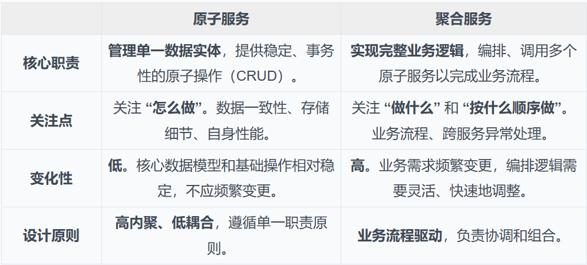

> 其实就是微服务 + 一个聚合其他微服务的“聚合服务”

进一步改进架构：

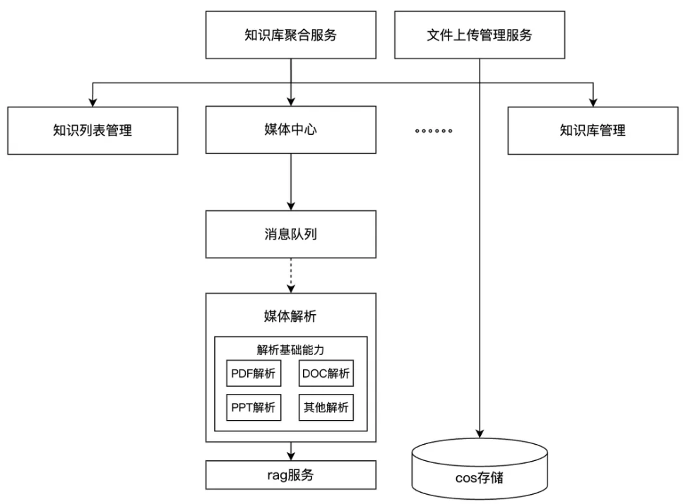


#### 数据一致性

由于采用了异步架构处理Media和Chunk。这客观上造成了在任何时间点，面向用户侧的 Media 对象与面向 RAG 系统的 Chunk 之间，都可能存在状态不一致的情况。

解法：以 Media 为核心，配合最终一致性修正

为解决此问题，我们设计了一套双重保障机制：以 Media 状态为核心，提供即时判断依据；增加异步对账服务，确保最终一致性。

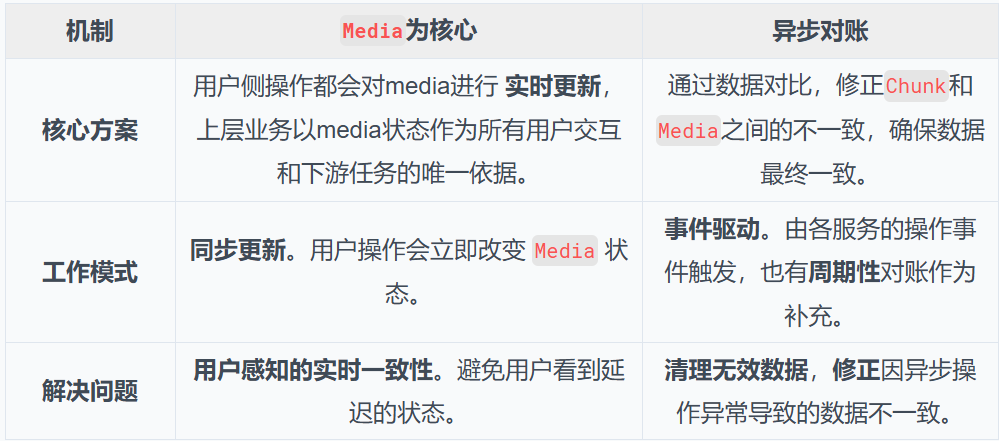


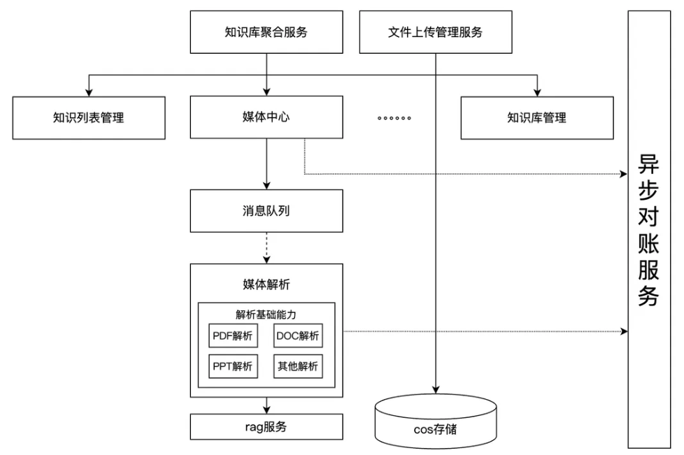


####  数据安全

> 对于知识库而言，权限体系是保障数据安全的生命线。ima 知识库的权限体系，正是我们为应对从个人使用到大规模团队协作等复杂场景而精心设计的成果。它遵循着一条清晰的演进路径，以确保在业务快速发展的每一个阶段，数据安全都坚如磐石。

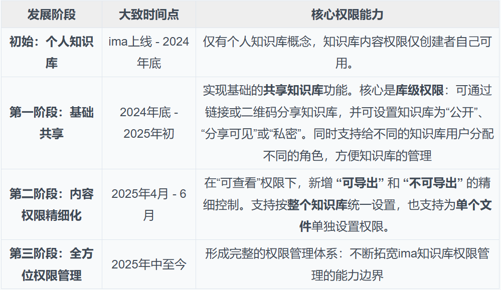


解法：权限深度建模+统一权限网关

为了前瞻性地解决复杂场景下的权限挑战，我们确立了明确的架构设计哲学。这套体系不仅满足了当前严密、多维度的权限需求，更为未来的功能扩展预留了坚实的基础，未来我们也会通过专门的文章分享更深入的实现细节。其总体思路可以概括为两大核心：权限深度建模与统一权限网关


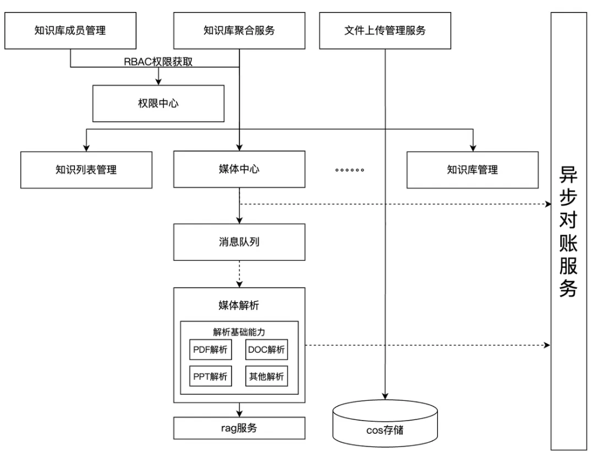


## 解决-知识应用

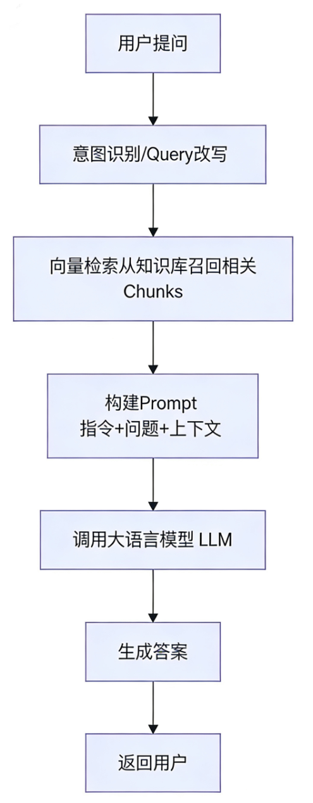


## chatAI

记录消息id和文件的对应关系，可以在消息记录中预览/下载之前上传的文件(多对多)


# 其他还需考虑的


- [ ] **可观测性**：日志、监控告警（解析失败率、处理耗时）
- [ ] **容错处理**：解析任务失败重试次数、上限
- [ ] **成本控制**：DashScope API 调用如何计费、限流
- [ ] **数据隔离**：多用户场景下，知识库数据的隔离策略


# 参考

[揭秘腾讯 Ima 知识库架构：从开源 WeKnora 看 RAG + 知识图谱落地实践_ima 开源-CSDN博客](https://blog.csdn.net/bbblllsss/article/details/155972033)


[IMA知识库：从0到1的架构设计与实践](https://blog.csdn.net/QcloudCommunity/article/details/156244975?ops_request_misc=&request_id=&biz_id=102&utm_term=ima-%E8%85%BE%E8%AE%AF%E4%BA%91%E8%AE%BE%E8%AE%A1&utm_medium=distribute.pc_search_result.none-task-blog-2~all~sobaiduweb~default-0-156244975.142^v102^control&spm=1018.2226.3001.4449)


